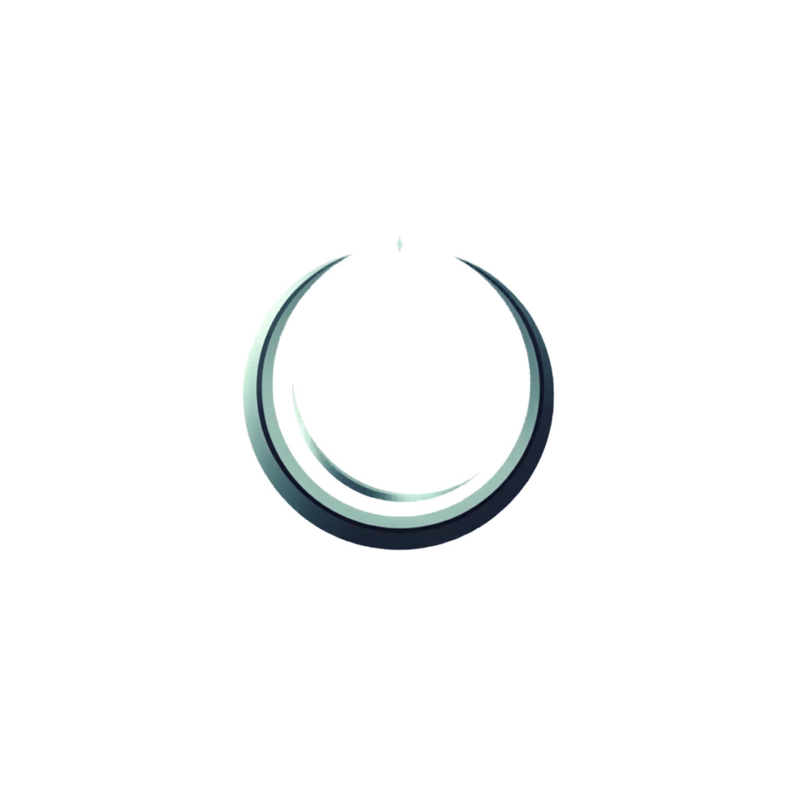

 

---

## Drox IDE & Drox TUI

| | [**Drox IDE**](https://github.com/DroxKiwi/Drox---IDE---OR) | [**Drox TUI**](https://github.com/DroxKiwi/Drox---TUI---OR) |
|---|---|---|
| **Rôle** | Releases officielles de l'éditeur (dérivé de VS Code + chat agent) | Releases officielles du terminal agent |
| **Interface** | Éditeur graphique · LSP · diffs · assistant de connexion IA | Terminal `drox-tui` · fil chronologique · `/diff` |
| **Moteur** | `drox.exe` + passerelle RPC → boucle **`tui_mono`** | Boucle **`tui_mono`** intégrée (Rust) |
| **Plateformes** | Windows (Linux prévu) | Windows · Linux |
| **Télécharger** | [Dernière version IDE](https://github.com/DroxKiwi/Drox---IDE---OR/releases/latest) | [Dernière version TUI](https://github.com/DroxKiwi/Drox---TUI---OR/releases/latest) |

> Même moteur agent, deux interfaces. Le **TUI** pour débuter léger ; l'**IDE** pour coder dans l'interface graphique.  
> Suivre l'avancement sur [@droxdev](https://www.instagram.com/droxdev/) 📸

---

## À propos

**Drox** est un moteur agent **local** pour des **agents légers** — souveraineté numérique, inférence sur ta machine, sessions stockées dans **`.drox/`** sur disque.  
Ces deux dépôts centralisent les **binaires et les mises à jour** ; ce profil en est la vitrine.

---

## Stack & outils

### Drox IDE

Éditeur **Electron** dérivé de **VS Code** · couche IDE en **TypeScript** · moteur agent en **Rust** · communication via **NDJSON** et **JSON-RPC**.

### Drox TUI

Interface **terminal** · boucle agent **`tui_mono`** en **Rust** · scripts d'installation **PowerShell** et **Shell** · builds **Windows** et **Linux**.

---

## Statistiques

  

**Drox IDE** — activité des commits dans le temps

 

  

**Drox TUI** — activité des commits dans le temps

 

---

